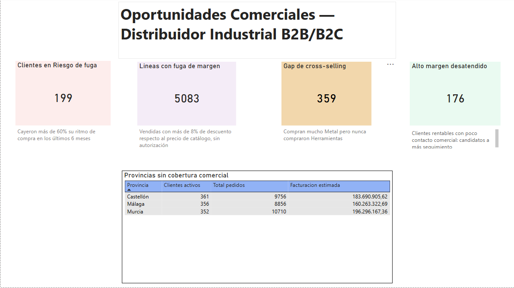

# Análisis Comercial de un Distribuidor Industrial B2B/B2C

Análisis de datos de ventas de un distribuidor industrial ficticio (metal, plástico,
componentes, herramientas y packaging), con dos objetivos: demostrar un flujo completo
de **limpieza de datos "sucios"** con Excel/Power Query y SQL, y usar ese análisis para
**detectar 5 oportunidades de negocio concretas** — no solo describir qué pasó, sino
señalar qué se puede hacer al respecto.



---

## Por qué este proyecto

La mayoría de los portfolios de análisis de datos muestran gráficos bonitos sobre datos
que ya vienen limpios. En el mundo real, la parte más pesada del trabajo —y la que más
tiempo consume— es descubrir y corregir los problemas de calidad de datos *antes* de
poder confiar en un solo número. Este proyecto pone esa parte al frente: cada hallazgo
final está acompañado del proceso de validación que lo respalda.

**Sobre el dataset:** es sintético (generado con Python), porque los datos comerciales
reales de una empresa son información sensible que no se publica. El dataset se diseñó
para tener el mismo tipo de problemas que aparecen en datos reales: formatos de fecha
mezclados, decimales en formato español e inglés conviviendo en la misma columna,
duplicados, categorías mal escritas, valores vacíos y errores de captura.

---

## Stack utilizado

- **Python** (pandas, Faker) — generación del dataset sintético
- **Excel / Power Query** — limpieza y normalización de datos, con validación en columnas dedicadas
- **SQL Server** — modelado, auditoría de calidad de datos y las 5 consultas de negocio
- **Power BI** — dashboard ejecutivo conectado directamente a vistas SQL

---

## Estructura del repositorio

```
├── data/
│   ├── originales_sucios/       # Los 4 CSV originales, sin modificar
│   └── limpios_sql/             # CSV ya limpios, listos para SQL
├── sql/
│   ├── 01_churn.sql
│   ├── 02_alto_margen_desatendido.sql
│   ├── 03_cross_selling.sql
│   ├── 04_fuga_margen.sql
│   └── 05_whitespace_regional.sql
├── docs/
│   └── img/                     # Capturas del proceso y del dashboard
├── dashboard_proyecto6.pbix     # Dashboard de Power BI
└── README.md
```

---

## El proceso de limpieza, en breve

Antes de cualquier análisis, los datos pasaron por una limpieza en dos etapas:

1. **Excel / Power Query:** normalización de texto (nombres, provincias, categorías),
   estandarización de NIFs, y conversión de columnas numéricas con formato decimal mixto
   (`426.96` y `232,29` conviviendo en la misma columna) usando lógica condicional
   celda por celda en vez de forzar un único formato regional.
2. **SQL Server:** auditoría sistemática de cada columna numérica (comparando MIN/MAX/AVG
   contra los rangos esperados) y cada columna de texto categórico (buscando variantes no
   normalizadas con `GROUP BY` + `COUNT`), detectando y corrigiendo varios errores de
   importación que habrían invalidado el análisis si no se hubiesen revisado a fondo.

*(El detalle completo de este proceso, incluidos los errores encontrados y cómo se
resolvieron, está documentado en `docs/CONCEPTOS_PROYECTO6.md`.)*

---

## Las 5 oportunidades de negocio

### 1. Clientes en riesgo de fuga (Churn) — 199 clientes

**El hallazgo:** 199 clientes que tenían un ritmo de compra habitual redujeron su
actividad más del 60% en los últimos 6 meses, comparado con su promedio histórico.

**Por qué importa:** en un negocio B2B, retener un cliente existente cuesta mucho menos
que conseguir uno nuevo. Una caída brusca y sostenida en la frecuencia de compra es la
señal más temprana y accionable de que un cliente se está yendo — y todavía hay margen
para contactarlo antes de perderlo del todo.

**Cómo se detectó:** `sql/01_churn.sql` — compara el promedio mensual de pedidos de cada
cliente antes y después de una fecha de corte, usando CTEs para separar el cálculo
histórico del reciente.

---

### 2. Alto margen desatendido — 176 clientes

**El hallazgo:** 176 clientes con volumen de compra bajo-medio (entre 3 y 25 pedidos)
donde al menos el 60% de sus compras son de productos con margen superior al 35%.

**Por qué importa:** son clientes rentables por cada venta, pero con poco contacto
comercial. Aumentar la frecuencia de seguimiento sobre esta cuenta específica tiene un
retorno más claro que perseguir clientes nuevos desde cero — ya demostraron que compran,
y compran bien.

**Cómo se detectó:** `sql/02_alto_margen_desatendido.sql` — cruza pedidos con el catálogo
de productos para calcular qué proporción de las compras de cada cliente corresponde a
productos de margen alto.

---

### 3. Gap de cross-selling: Metal sin Herramientas — 359 clientes

**El hallazgo:** 359 clientes con compras frecuentes de la categoría "Metal" (5 o más
pedidos) que nunca compraron nada de "Herramientas" — a pesar de que ambas categorías
suelen ir juntas en el resto de la base de clientes.

**Por qué importa:** es una venta cruzada evidente que el equipo comercial no está
ofreciendo. No hace falta convencer a estos clientes de que confíen en la empresa — ya
son clientes activos — solo hace falta ofrecerles el producto complementario correcto.

**Cómo se detectó:** `sql/03_cross_selling.sql` — identifica clientes con compras
recurrentes de Metal y los cruza contra quiénes compraron Herramientas alguna vez.

---

### 4. Fuga de margen por descuentos no autorizados — 5.083 líneas de pedido

**El hallazgo:** 5.083 líneas de pedido (aproximadamente el 5% del total) se vendieron
con un descuento de entre 8% y 25% respecto al precio de catálogo, sin ninguna
justificación aparente (no es un patrón de descuento por volumen documentado).

**Por qué importa:** el precio de catálogo ya incorpora el margen esperado para cada
producto. Cada venta por debajo de ese precio, sin autorización, reduce ese margen
directamente. Identificar el patrón permite auditar si se concentra en ciertos
vendedores, clientes o productos puntuales.

**Cómo se detectó:** `sql/04_fuga_margen.sql` — compara el precio real de cada línea de
pedido contra el precio de catálogo del producto correspondiente.

---

### 5. Whitespace regional: zonas sin cobertura comercial

**El hallazgo:** Murcia, Castellón y Málaga tienen clientes activos con pedidos reales
— 352, 361 y 356 clientes respectivamente — pero **ningún comercial asignado** en esas
provincias.

**Por qué importa:** no es un mercado hipotético: ya hay demanda comprobada en esas
zonas. Asignar cobertura comercial dedicada ahí tiene más probabilidad de retorno
inmediato que abrir mercado en una región completamente nueva.

**Cómo se detectó:** `sql/05_whitespace_regional.sql` — cruza la provincia de cada
cliente activo contra la lista de provincias con al menos un comercial asignado.

---

## Dashboard

El dashboard de Power BI (`dashboard_proyecto6.pbix`) resume las 5 oportunidades en una
sola vista, conectado directamente a **vistas SQL** (no a medidas DAX recalculadas) —
esto garantiza que los números del dashboard sean exactamente los mismos que los
documentados en este README y en las consultas SQL, sin margen para inconsistencias
entre herramientas.


---

## Una nota honesta sobre las limitaciones

Este análisis trabaja con precio de catálogo y margen estándar por producto, pero no con
costos reales — así que "fuga de margen" mide desviación respecto al precio de lista, no
pérdida de rentabilidad exacta en euros. Con datos de costo real, este mismo enfoque se
podría afinar para calcular impacto en margen neto en vez de solo en precio.

---

## Autor

Lucas Espinosa — [LinkedIn](https://www.linkedin.com/in/lucasespinosaa/) · [Portfolio](https://lucasees.github.io/portfolio/)
